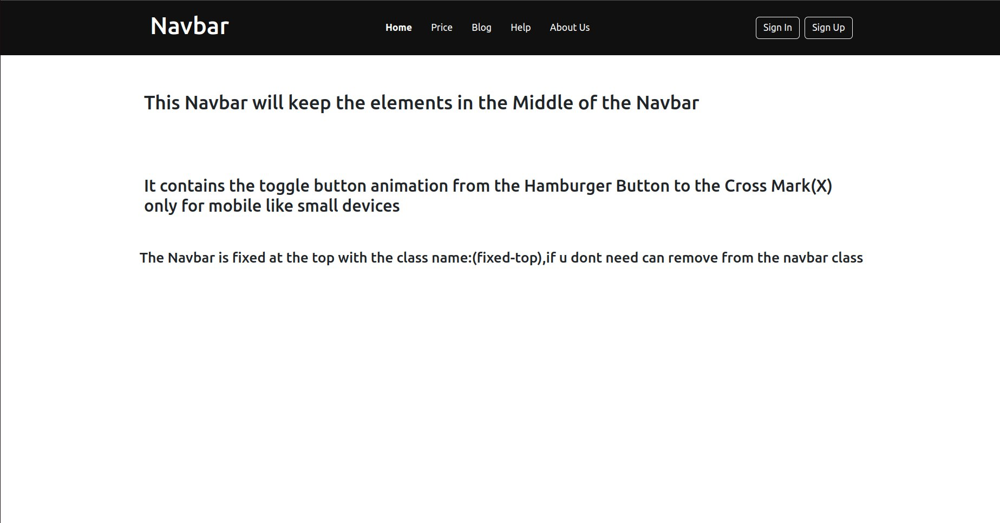
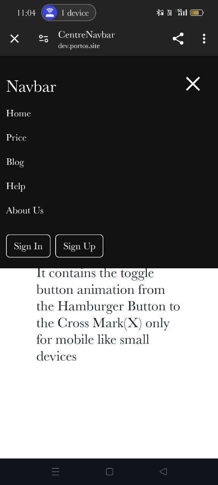

# CentreNavbar

This file contains the implementation of a responsive Navbar. Below are the key features and functionalities:

1. **Centered Navbar Elements**: The elements in the Navbar are centered both in the Navbar and on the page, providing a balanced and aesthetically pleasing layout.

2. **Fixed Navbar**: The Navbar is fixed at the top of the page, ensuring it remains visible as users scroll through the content.

3. **Responsive Design**: The Navbar is designed to be responsive, adapting to various screen sizes from desktop to mobile devices.

4. **Animated Toggle Button**: On mobile devices, the toggle button for the Navbar changes from a hamburger icon to a cross mark (X) when clicked. This animation provides a clear visual indication of the menu state.

## Examples

### Desktop View

### Mobile View

