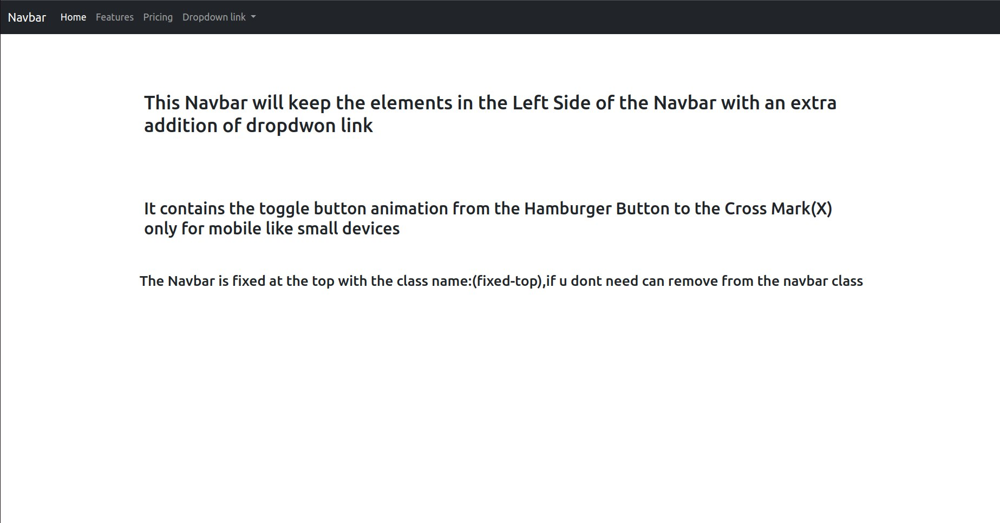
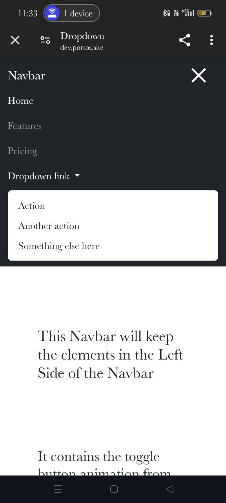

# DropdownNavbar

This file contains a Navbar with the following features:
- Navbar elements aligned to the left side of the Navbar and the page.
- An extra element in the Navbar which is a dropdown button that, when clicked, shows multiple redirection options.
- The Navbar is fixed at the top of the page.
- On mobile devices, the toggle button animates from a hamburger icon to a cross mark (X) when clicked.

## Desktop View

## Mobile View

