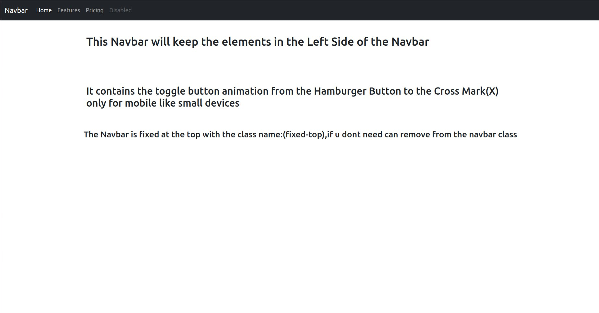
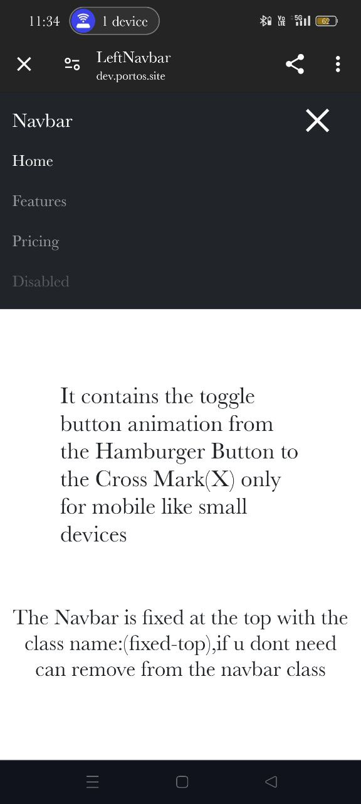

# LeftNavbar

This file contains a Navbar where all the elements are aligned to the left side of the Navbar and the page.

## Features
- **Fixed Navbar**: The Navbar stays at the top of the page even when scrolling.
- **Left-Aligned Elements**: All elements within the Navbar are aligned to the left.
- **Responsive Design**: Ensures compatibility with both desktop and mobile devices.
- **Animated Toggle Button**: The toggle button transitions from a hamburger icon to a cross mark (X) on mobile devices.

## Examples

### Desktop View

### Mobile View

