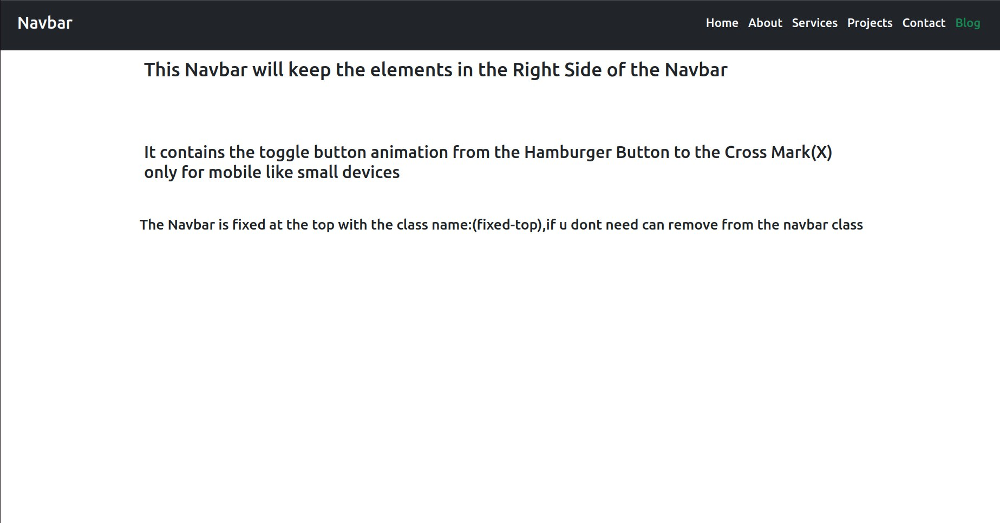
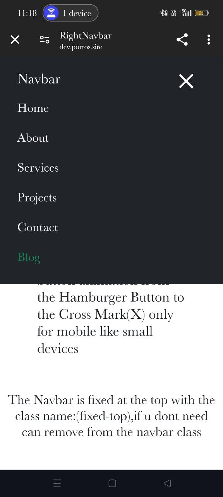

# RightNavbar

This file contains a Navbar where all the elements are aligned to the right side of the Navbar and the page. The Navbar is fixed at the top, ensuring it remains visible as you scroll through the page. Additionally, an animation has been added to the toggle button on mobile devices, which changes from a hamburger icon to a cross mark (X) when clicked.

## Features
- **Fixed Navbar**: The Navbar stays at the top of the page even when scrolling.
- **Right-Aligned Elements**: All elements within the Navbar are aligned to the right.
- **Responsive Design**: Ensures compatibility with both desktop and mobile devices.
- **Animated Toggle Button**: The toggle button transitions from a hamburger icon to a cross mark (X) on mobile devices.

## Examples

### Desktop View

### Mobile View

